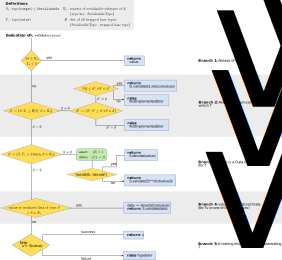

# Implementation logic

```{note}
The documentation on this page is meant for developers, and for people who want to know exactly how validation is implemented. It should not be required for standard use.
```

## Validation logic

The goal is that when one calls `TargetType.validate(obj)`, either the resulting object an instance of `TargetType` (possibly a subclass), or an error is raised. This should work whether `obj` is already of type `TargetType`, of some different type that can be cast to `TargetType`, or some serialized data compatible with `TargetType`. Thus the validation logic must check for all this possibilities, and implements different validation procedures for each. A schematic is shown below:



This logic relies on two registries:
- A registry of *base types*, composed of `{type: type}` pairs mapping serializable types to arbitrary compatible types.  
  For example, the pair `{Array: numpy.ndarray}` indicates that the type `Array` provides a serializer for `numpy.ndarray`.
  This is labelled $\mathcal{B}$ in the diagramme, and `ABCSerializable._base_types` in the code.
- A registry of *serializable subtyes*, composed of `{string: type}` pairs mapping a key to a *serializable* type. Keys are created by calling `get_type_key` on the serializable type being added, which will result in pairs like `{"scityping.numpy.Array": Array}`. These keys are serialized along with the data, and allow the validation logic to determine exactly which deserializer to use.  
  Each serializable type maintains its own subtype registry, so that entries in the registry for `Array` only correspond to subclasses of `Array`, or at least types which are Liskov-substitutable.  
  This registry is labeled $\mathcal{R}_t$ in the diagramm (where $t$ indicates the subclass of `Serializable` to which the registry is attached), and `<Serializable subclass>._registry` in the code.

## Serialization logic

An important goal of *scityping* is to allow writing code that will serialize variables without knowing in advance what the type of those variables are. This is implemented via a dispatch mechanism in the JSON encoder of the base class, `Serializable.json_encoder`. Given `S`, a subclass of `Serializable`, then `S.json_encoder(obj)` will do the following:
- Look through `S._registry` for an entry `(nm, S')` matching `type(obj)`, or any of its parent types. (More specific types are preferred.)
- Serialize `obj` into `data`, using `S'.Data.encode`.
- Return the tuple `(nm, data)`.

(This assumes that `S` does not override its `json_encoder` method; typically `S` is `Serializable`.)

Crucially, type name matching allows for fuzzy matches, so the key `"scityping.numpy.Generator"` will also match the type `numpy.random.Generator`; i.e. some tokens separated by `"."` may be ommitted. Tokens are matched case-insensitive, must preserve order, must match on the rightmost token,[^rightmost] and must result in a unique match. Some examples

| Registry                                       | `obj` type             | Matches           |
|:-----------------------------------------------|:-----------------------|:------------------|
| {"Complex": \*}                                | complex                | "Complex"         |
| {"Juniper": \*}                                | complex                | raises `KeyError` |
| {"Generator": \*}                              | numpy.random.Generator | "Generator"       |
| {"gENeRatOR": \*}                              | numpy.random.Generator | "gENeRatOR"       |
| {"Generator": \*, "generator": \*}             | numpy.random.Generator | disallowed[^1]    |
| {"Generator": \*}                              | torch.Generator        | "Generator"       |
| {"numpy.Generator": \*}                        | torch.Generator        | "numpy.Generator" |
| {"numpy.Generator": \*, "torch.Generator": \*} | torch.Generator        | "torch.Generator" |
| {"numpy.Generator": \*}                        | Generator.numpy        | raises `KeyError` |
| {"numpy.Generator": \*}                        | numpy.Generator.Data   | raises `KeyError` |
| {"Generator": \*, "torch.Generator": \*}       | torch.Generator        | "torch.Generator" |
| {"Generator": \*}                              | mypkg.Generator        | "Generator"       |
| {"Generator": \*, "torch.Generator": \*}       | mypkg.Generator        | raises `KeyError` |

In the last example, the logic cannot find an unambiguous unique match, so no match is returned.

[^1]: Adding multiple keys to a registry which differ only in their case is not allowed, since neither then can ever match successfully.
[^rightmost]: The rightmost token must match because that is the one corresponding to the type name. We don't want for example `builtins.dict` matching `builtins.tuple`.

The matching logic is implement by `scityping.utils.TypeRegistry`.
